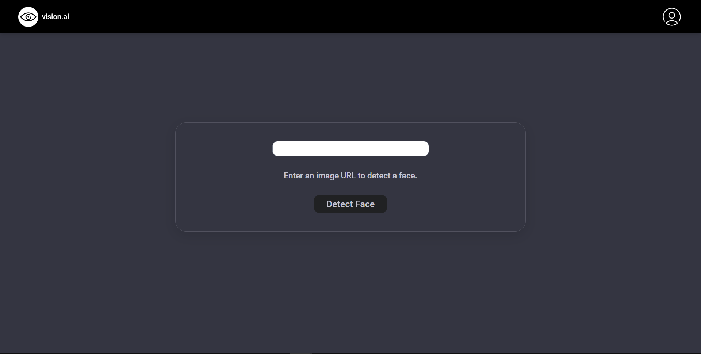

# [vision ai](https://vision-ai-test.vercel.app/)

Web project made using React, Express, Postgresql and Vercel

## Preview



## Installation

First, install the project dependencies:

```bash
npm install
```

Then, install Vercel CLI globally:

```bash
npm i -g vercel

```

## Usage

To run the project locally, use the` vercel dev` command:

```bash
vercel dev
```
